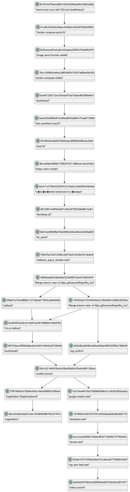

# Git Dependency Graph Visualizer

## 1. Общее описание

Этот проект представляет собой инструмент командной строки, который позволяет визуализировать граф зависимостей между коммитами в Git-репозитории, включая транзитивные зависимости. Зависимости представляются в виде диаграммы, сгенерированной в формате PlantUML. В каждом узле графа содержится сообщение коммита. Пользователь может задать дату, и граф будет строиться только для коммитов, сделанных до этой даты.

Конфигурация проекта осуществляется с помощью файла `config.toml`, который содержит путь к репозиторию, дату фильтрации и путь к программе визуализации PlantUML.

## 2. Описание всех функций и настроек

### Функции:

- **`get_commits_before_date(repo_path, before_date)`**:
  - Описание: Получает список коммитов в заданном Git-репозитории до указанной даты.
  - Аргументы:
    - `repo_path`: Путь к репозиторию.
    - `before_date`: Дата, до которой следует отбирать коммиты (в формате `YYYY-MM-DD`).
  - Возвращает: Список коммитов с их хэшами, родителями и сообщениями.

- **`sanitize_message(message)`**:
  - Описание: Очищает сообщение коммита от специальных символов, которые могут нарушать синтаксис PlantUML.
  - Аргументы:
    - `message`: Строка, содержащая сообщение коммита.
  - Возвращает: Очищенное сообщение.

- **`generate_plantuml(commit_data)`**:
  - Описание: Генерирует текстовое представление графа в формате PlantUML на основе данных о коммитах.
  - Аргументы:
    - `commit_data`: Список коммитов (их хэши, родители, сообщения).
  - Возвращает: Строку в формате PlantUML.

- **`save_uml_to_file(uml_content, filename)`**:
  - Описание: Сохраняет сгенерированный UML-граф в файл.
  - Аргументы:
    - `uml_content`: Сгенерированное представление диаграммы в PlantUML.
    - `filename`: Имя файла для сохранения.

- **`visualize_uml(plantuml_jar_path, uml_file)`**:
  - Описание: Запускает визуализацию PlantUML с использованием программы, путь к которой передается через параметр `plantuml_jar_path`.
  - Аргументы:
    - `plantuml_jar_path`: Путь к JAR-файлу PlantUML.
    - `uml_file`: Файл с содержимым диаграммы PlantUML.

### Настройки:

Конфигурационный файл `config.toml` должен содержать следующие настройки:

```toml
[settings]
visualization_tool_path = "Путь к файлу plantuml.jar"
repository_path = "Путь к Git-репозиторию"
before_date = "Дата в формате YYYY-MM-DD"
```

## 3. Описание команд для сборки проекта

### Предварительные требования:

1. Убедитесь, что у вас установлен **Python** (версия 3.6 или выше).
2. Убедитесь, что установлен **Git** для доступа к истории коммитов.
3. Установите **Java**, так как для работы с PlantUML требуется Java Runtime Environment (JRE).
4. Скачайте **PlantUML** JAR-файл с официального сайта: [https://plantuml.com/download](https://plantuml.com/download).

### Шаги для сборки проекта:

1. Клонируйте репозиторий или создайте структуру проекта.
2. Настройте файл `config.toml` для вашего проекта (пример приведен выше).
3. Убедитесь, что все зависимости установлены.

### Команды для запуска:

1. **Запуск основного скрипта**:
   ```bash
   python main.py
   ```

2. **Запуск тестов**:
   ```bash
   python -m unittest test_graph_tool.py
   ```

## 4. Примеры использования

### Пример работы программы:

1. Команда в командной строке:
   ```bash
   python main.py
   ```

2. Пример визуализированного графа:
   

3. Пример настроек файла `config.toml`:
   ```toml
   [settings]
   visualization_tool_path = "C:/Users/YourName/Downloads/plantuml.jar"
   repository_path = "C:/Users/YourName/Projects/MyProject"
   before_date = "2023-12-31"
   ```

## 5. Результаты прогона тестов

Пример успешного прогона тестов:

```bash
$ python -m unittest test_graph_tool.py
...
----------------------------------------------------------------------
Ran 3 tests in 0.002s

OK
```

Тесты проверяют:
1. Корректность парсинга коммитов из Git (`get_commits_before_date`).
2. Очищение сообщений коммитов от специальных символов (`sanitize_message`).
3. Генерацию корректного PlantUML графа на основе данных о коммитах (`generate_plantuml`).
